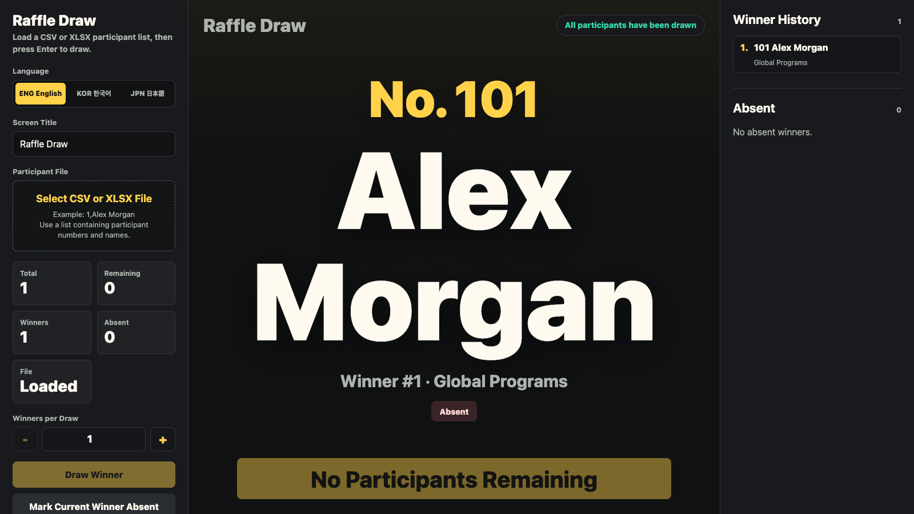
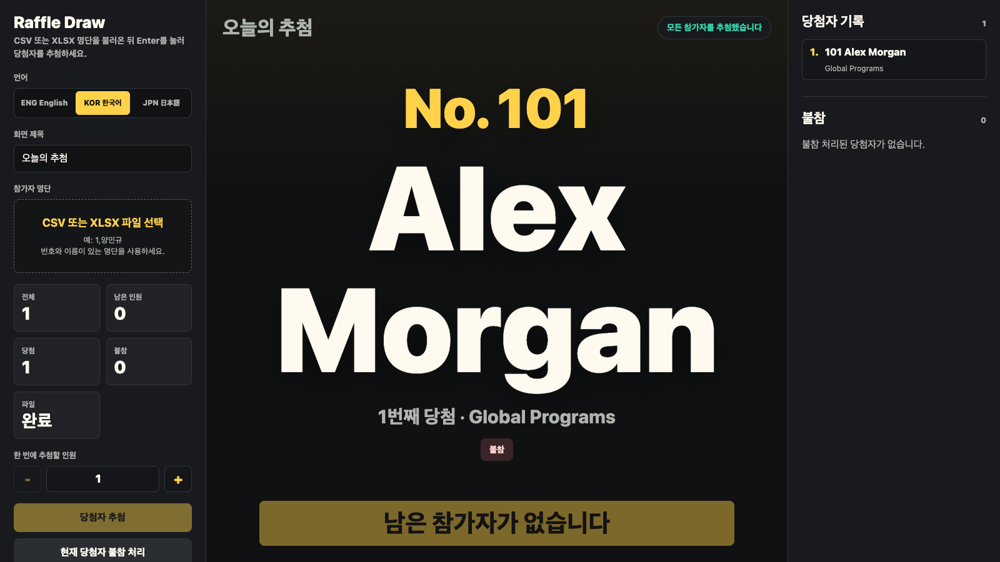
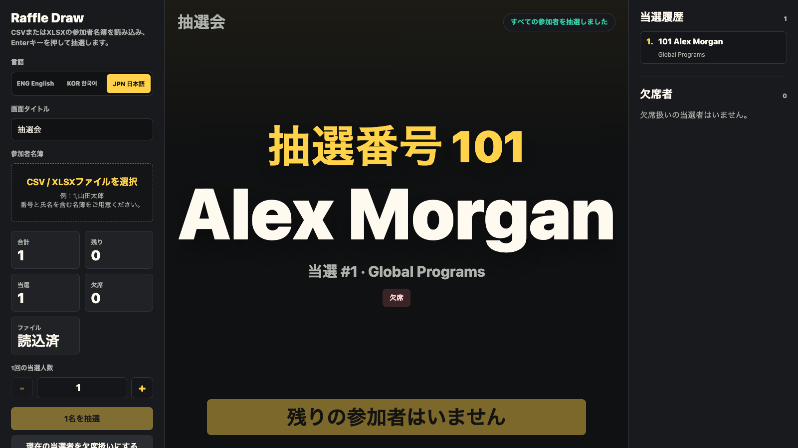

# Raffle Draw

An offline event-screen raffle app for drawing 1 to 50 winners at a time from a
CSV or XLSX participant list.

The interface can switch between English (`ENG English`), Korean
(`KOR 한국어`), and Japanese (`JPN 日本語`). English, Korean, and Japanese
participant files can be used without changing the draw workflow.

Participant CSV/XLSX files are intentionally ignored by Git. The verification
script generates its own test data and does not require a real participant list.

## Screenshots

All screenshots use the same sample participant at a 1600 × 900 viewport.

### English



### 한국어



### 日本語



## How to Run

Open `index.html` directly in a modern browser. No installation or server is
required. Select the interface language before loading a list so legacy CSV
encoding detection can prefer the correct locale.

## Korean Participant Format

Minimum format:

```csv
No,Korean Name,Affiliation
1,양민규,DevRel
2,김민수,Engineering
```

Recommended format for a live event:

```csv
No,Korean Name,English Name,Affiliation
1,양민규,Yang Min-gyu,DevRel
2,김민수,Kim Min-su,Engineering
```

An explicit `English Name` is used exactly as provided. Otherwise, a readable
romanization is generated from the Hangul name.

## Japanese Participant Format

Minimum format:

```csv
抽選番号,氏名,所属
101,山田太郎,営業
102,佐藤優希,研究開発
```

Recommended format:

```csv
抽選番号,氏名,フリガナ,ローマ字,所属
101,山田太郎,ヤマダ タロウ,Taro Yamada,営業
102,佐藤優希,サトウ ユウキ,,研究開発
```

Japanese display-name priority is:

1. Explicit `ローマ字`, `英字氏名`, or `English Name`
2. Automatic romanization of `フリガナ`, `ふりがな`, or another reading column
3. Automatic romanization when the original name is entirely Hiragana/Katakana
4. The original name when Kanji has no reading (Kanji pronunciation is never guessed)

Japanese files without a number column, such as `氏名,フリガナ,所属`, are also
accepted; row numbers are generated automatically.

## File Compatibility

- CSV: UTF-8, Korean EUC-KR/CP949, and Japanese Shift-JIS/CP932
- Spreadsheet: `.xlsx`
- Legacy `.xls` is not supported; save it as `.xlsx` or `.csv`
- Korean raffle-number headers such as `행운권 추첨번호` and `추첨번호` are recognized
- Japanese raffle-number headers such as `抽選番号`, `くじ番号`, and `整理番号` are recognized

## Controls

- `Enter` or `Space`: draw winners
- `-`, number input, or `+`: choose 1 to 50 winners per draw
- Full screen: present on a monitor
- Mark absent: remove a called winner and prepare a replacement draw
- Restore last absent: undo an accidental absent mark
- Undo last winner: return the latest winner to the draw pool
- Save results CSV: export both winner and absent records
- Restart draw: clear draw history for the loaded list

The selected language, loaded list, winners, absentees, and draw count are kept
in browser local storage so an interrupted event can be restored.

## Verification

Run:

```sh
node verify.js
```

Coverage includes all three interface languages, English/Korean/Japanese
headers, Hangul and Kana romanization, explicit Romanized Name priority,
Shift-JIS and EUC-KR decoding, XLSX parsing, 1-to-50-person draws, uniqueness,
absent/replacement flows, undo/restore, quoted CSV values, and result export.
